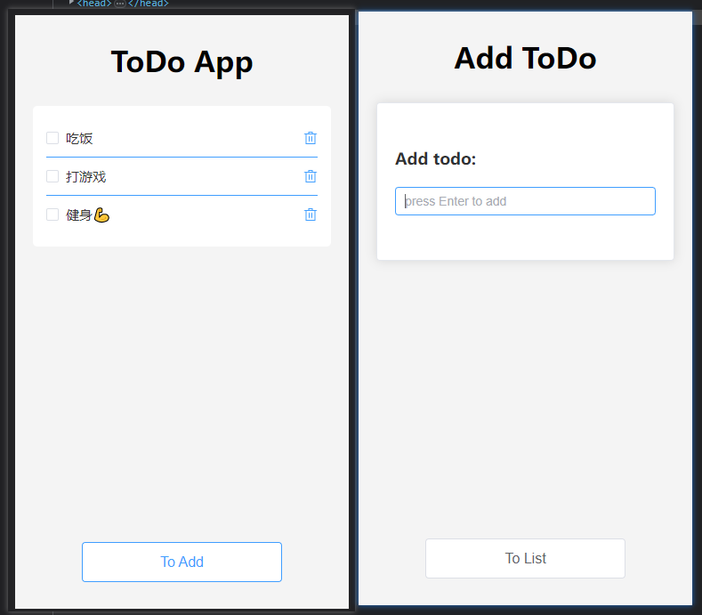

# todo-list-vue3-ts



### git branch
为了学习使用pinia，demo中状态库写了vuex v4和pinia两个版本，分别对应master branch和pinia branch；checkout 到对应branch安装依赖运行。

## Project setup
```
yarn install
```

### Compiles and hot-reloads for development
```
yarn serve
```

### Compiles and minifies for production
```
yarn build
```

### Lints and fixes files
```
yarn lint
```

### Customize configuration
See [Configuration Reference](https://cli.vuejs.org/config/).
